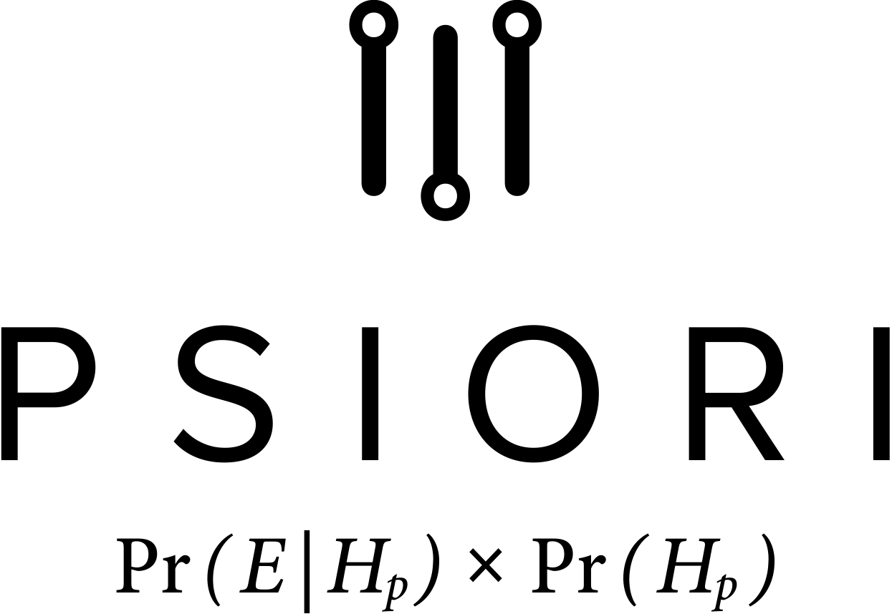

# Deep Topology Learning (DeToL)

Deep Learning, i.e. deep neural networks (DNN), have 
become a key technology in recent years. However, the design of new, 
problem specific network topologies is still a time and compute 
intensive process. So far, the design of deep learning solutions for 
specific applications mostly follows a purely heuristic try and error 
process based on human expert knowledge and experience. Every network 
topology needs to be built from a large number of layer types and their 
configuration. Most layers themselves, as well as the employed training 
methods, have complex parameter spaces (so-called hyperparameters), 
whose impact on the final DNN performance is as large as the impact of 
the network topology itself.

In this project, we aim at facilitating a more efficient topology design 
process, rendering DNNs accessible to unexperienced users.

**DeToL** is funded by BMBF. Runtime: October 2018 - September 2021.

## Partners

 
 

 

## Publications
* [Ying, C., Klein, A., Real, E., Christiansen, E., Murphy, K., & Hutter, F. (2019). NAS-Bench-101: Towards Reproducible Neural Architecture Search. arXiv preprint arXiv:1902.09635.](https://arxiv.org/abs/1902.09635)
* [Ram, R., Müller, S., Pfreundt, F. J., Gauger, N. R., & Keuper, J. (2019, November). Scalable Hyperparameter Optimization with Lazy Gaussian Processes. In 2019 IEEE/ACM Workshop on Machine Learning in High Performance Computing Environments (MLHPC) (pp. 56-65). IEEE.](https://arxiv.org/pdf/2001.05726) - **[Source Code](https://github.com/cc-hpc-itwm/HPO_LazyGPR)**
* [Habelitz, P. M., & Keuper, J. (2020). PHS: A Toolbox for Parellel Hyperparameter Search. arXiv preprint arXiv:2002.11429.](https://arxiv.org/pdf/2002.11429) - **[Source Code](https://github.com/cc-hpc-itwm/PHS)**
* [Zela, A., Elsken, T., Saikia, T., Marrakchi, Y., Brox, T., & Hutter, F. (2020). Understanding and Robustifying Differentiable Architecture Search. In International Conference on Learning Representations 2020.](https://arxiv.org/abs/1909.09656) - **[Source Code](https://github.com/automl/RobustDARTS)**
* [Zela, A., Siems, J., & Hutter, F. (2020). NAS-Bench-1Shot1; Benchmarking and Dissecting One-shot Neural Architecture Search. In International Conference on Learning Representations 2020.](https://arxiv.org/abs/2001.10422) - **[Source Code](https://github.com/automl/nasbench-1shot1)**
* A Variational-Sequential Graph Autoencoder for Neural Architecture Performance Prediction, D Friede, J Lukasik, H Stuckenschmidt, M Keuper, arXiv preprint arXiv:1912.05317
* Massively parallel benders decomposition for correlation clustering, M Keuper, J Lukasik, M Singh, J Yarkony, arXiv preprint arXiv:1902.05659
* [Tonmoy Saikia, Yassine Marrakchi, Arber Zela, Frank Hutter, Thomas Brox, AutoDispNet: Improving Disparity Estimation With AutoML, IEEE International Conference on Computer Vision (ICCV), 2019](https://lmb.informatik.uni-freiburg.de/Publications/2019/SMB19/) - **[Source code](https://github.com/lmb-freiburg/autodispnet)**
* Ram, R., Müller, S., Pfreundt, F. J., Gauger, N. R., & Keuper, J. . "Scalable Hyperparameter Optimization with Lazy Gaussian Processes." 2019 IEEE/ACM Workshop on Machine Learning in High Performance Computing Environments (MLHPC). IEEE, 2019.
* Chatzimichailidis, A., Keuper, J., Pfreundt, F. J., & Gauger, N. R. . "GradVis: Visualization and Second Order Analysis of Optimization Surfaces during the Training of Deep Neural Networks." 2019 IEEE/ACM Workshop on Machine Learning in High Performance Computing Environments (MLHPC). IEEE, 2019
* [Y. Yang, Y. Yuan, A. Chatzimichailidis, R. JG van Sloun, L. Lei, S. Chatzinotas, "ProxSGD: Training Structured Neural Networks under Regularization and Constraints," in Proc. International Conference on Learning Representation  Apr. 2020.](https://openreview.net/forum?id=HygpthEtvr)
* [Lucas Zimmer, Julien Siems, Arber Zela, Frank Hutter: “LCBench: A learning curve benchmark on OpenML data”](https://github.com/automl/LCBench)
* D. Brayford, S. Vallecorsa, A. Atanasov, F. Baruffa and W. Riviera, "Deploying AI Frameworks on Secure HPC Systems with Containers.," 2019 IEEE High Performance Extreme Computing Conference (HPEC), Waltham, MA, USA, 2019, pp. 1-6.
* D. Brayford, S. Vallecorsa, A. Atanasov, F. Baruffa and W. Riviera, "Deploying Scientific AI Networks at Petaflop Scale on Secure Large Scale HPC Production Systems with Containers." 2020 PASC, 2020.

## Open Source Software
* https://github.com/automl/nas_benchmarks/tree/master/experiment_scripts
* https://github.com/automl/LCBench
* https://github.com/lmb-freiburg/autodispnet

## Open Data
+ -tba-

## Contact
info@detol.de
